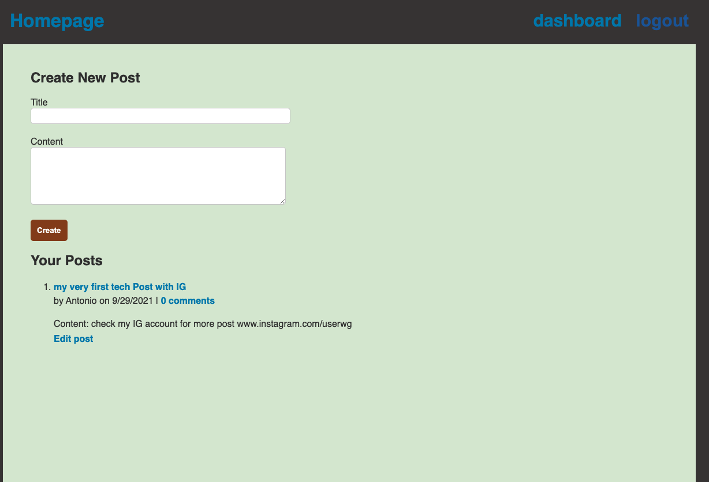
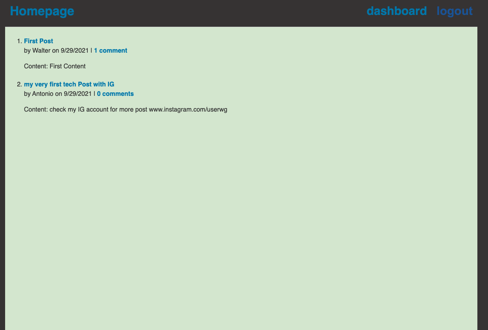

GIVEN a CMS-style blog site
<!-- WHEN I visit the site for the first time
THEN I am presented with the homepage, which includes existing blog posts if any have been posted; navigation links for the homepage and the dashboard; and the option to log in -->
<!-- WHEN I click on the homepage option
THEN I am taken to the homepage -->
<!-- WHEN I click on any other links in the navigation
THEN I am prompted to either sign up or sign in -->
<!-- WHEN I choose to sign up
THEN I am prompted to create a username and password -->
<!-- WHEN I click on the sign-up button
THEN my user credentials are saved and I am logged into the site -->
<!-- WHEN I revisit the site at a later time and choose to sign in
THEN I am prompted to enter my username and password -->
<!-- WHEN I am signed in to the site
THEN I see navigation links for the homepage, the dashboard, and the option to log out -->
<!-- WHEN I click on the homepage option in the navigation
THEN I am taken to the homepage and presented with existing blog posts that include the post title and the date created -->
WHEN I click on an existing blog post
THEN I am presented with the post title, contents, post creator’s username, and date created for that post and have the option to leave a comment
<!-- WHEN I enter a comment and click on the submit button while signed in
THEN the comment is saved and the post is updated to display the comment, the comment creator’s username, and the date created -->
<!-- WHEN I click on the dashboard option in the navigation
THEN I am taken to the dashboard and presented with any blog posts I have already created and the option to add a new blog post -->
WHEN I click on the button to add a new blog post
THEN I am prompted to enter both a title and contents for my blog post
WHEN I click on the button to create a new blog post
THEN the title and contents of my post are saved and I am taken back to an updated dashboard with my new blog post
<!-- WHEN I click on one of my existing posts in the dashboard
THEN I am able to delete or update my post and taken back to an updated dashboard -->
<!-- WHEN I click on the logout option in the navigation
THEN I am signed out of the site
WHEN I am idle on the site for more than a set time
THEN I am able to view comments but I am prompted to log in again before I can add, update, or delete comments -->

<!--------------------------------------------------------------------------------------------------------------------------------------------------------------------------------------------------->
<!--------------------------------------------------------------------------------------------------------------------------------------------------------------------------------------------------->
<!--------------------------------------------------------------------------------------------------------------------------------------------------------------------------------------------------->
<!--------------------------------------------------------------------------------------------------------------------------------------------------------------------------------------------------->
<!--------------------------------------------------------------------------------------------------------------------------------------------------------------------------------------------------->
<!--------------------------------------------------------------------------------------------------------------------------------------------------------------------------------------------------->
<!--------------------------------------------------------------------------------------------------------------------------------------------------------------------------------------------------->
<!--------------------------------------------------------------------------------------------------------------------------------------------------------------------------------------------------->
<!--------------------------------------------------------------------------------------------------------------------------------------------------------------------------------------------------->
<!--------------------------------------------------------------------------------------------------------------------------------------------------------------------------------------------------->
<!--------------------------------------------------------------------------------------------------------------------------------------------------------------------------------------------------->
<!--------------------------------------------------------------------------------------------------------------------------------------------------------------------------------------------------->
<!--------------------------------------------------------------------------------------------------------------------------------------------------------------------------------------------------->
<!--------------------------------------------------------------------------------------------------------------------------------------------------------------------------------------------------->
<!--------------------------------------------------------------------------------------------------------------------------------------------------------------------------------------------------->
<!--------------------------------------------------------------------------------------------------------------------------------------------------------------------------------------------------->
<!--------------------------------------------------------------------------------------------------------------------------------------------------------------------------------------------------->
<!--------------------------------------------------------------------------------------------------------------------------------------------------------------------------------------------------->
<!--------------------------------------------------------------------------------------------------------------------------------------------------------------------------------------------------->
<!--------------------------------------------------------------------------------------------------------------------------------------------------------------------------------------------------->
<!--------------------------------------------------------------------------------------------------------------------------------------------------------------------------------------------------->
<!--------------------------------------------------------------------------------------------------------------------------------------------------------------------------------------------------->
<!--------------------------------------------------------------------------------------------------------------------------------------------------------------------------------------------------->
<!--------------------------------------------------------------------------------------------------------------------------------------------------------------------------------------------------->


# my-first-tech-blog

[](https://opensource.org/licenses/Artistic-2.0)

## Description
An application to post comments/news and other links tech related


## Table of Contents

* [Installation](#installation)
* [Demo](#demo)
* [Usage](#usage)
* [License](#license)
* [Contribution](#contribution)
* [Questions](#questions)


## Installation

1. You must download and install Node.js click on link: https://nodejs.org/en/download/

2. Download and install MySQL Community Server from this link: https://dev.mysql.com/downloads/mysql/. For a complete guide on how to install it properly depending on your operating system (Windows, macOS, Linux), review this link: https://coding-boot-camp.github.io/full-stack/mysql/mysql-installation-guide 

3. copy or clone this repo into the folder where you want the application to be created by entering the following command in your terminal (mac) or gitbash (windows):
    * git clone git@github.com:walterlaw19/employee-tracker.git   (<---- Copy, Paste, Enter this command in your terminal)

4. Open the employee-tracker folder from your your VS Code (make sure you are in the right folder) or you can use the integrated terminal, go to the directory where the employee-tracker folder was installed: e.g. "cd employee-tracker"

5. Once you are in the employee-tracker folder, navigate to db/connection.js and open the file to update your SQL credentials.  *** You should ONLY update user: (line 7) and password (line 9) with your own username and password. Save the changes.

6. Back in the employee-tracker root directory, open your integrated terminal in VS Code and install the dependencies by entering the command: 'npm i'.  Wait for the installation to be completed.

7. after the installation has be completed, you must login to MySQL shell. Enter "msyql -u 'your SQL username' -p" and press Enter. Now you will be prompted to enter your SQL Password. Once you are logged in, enter the following commands in this order to clear/seed the MySQL database properly. 

```
A. source db/db.sql
B. source db/schema.sql
C. source db/seeds.sql
D. quit
```
8. In the terminal, type "node index" to run the application.

7. You can go through the Menu and select as desired. It is recommended to always enter a Department first, then Role and finally an Employee

9. Once you are done, you can select "exit database" or press CTRL + C in your keyboard to stop the application.


## Demo

[Click here to see a demo video]()

 "Run NODE INDEX and view all deparments/roles/employees"
 "Add departments/roles/employees and update employees"


## Usage

You can use this application to post information about tech
 
## License

[](https://opensource.org/licenses/MIT)

## contribution

Please send me an email if you can want to contribute or submit any suggestions: walterlaw19@gmail.com

## Questions

If you have any questions or concerns, you can reach me at: walterlaw19@gmail.com

or visit my GitHub: https://github.com/walterlaw19


```
Made by by Walter G
```

---
##### © 2021 WG.


