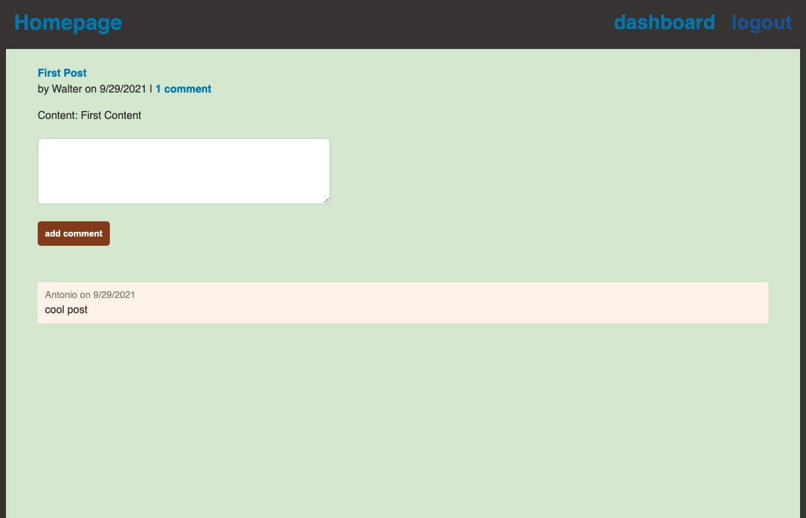

# my-first-tech-blog

[](https://opensource.org/licenses/Artistic-2.0)

## Description
An application to post comments/news/ideas and suggestions about technology and how to make our lives a lot easier with the option to link to a website or your own page.

## Table of Contents

* [Demo](#demo)
* [Usage](#usage)
* [License](#license)
* [Contribution](#contribution)
* [Questions](#questions)


## Demo

 "create post"
 "view all posts"
 "view/add comments"


## Usage

You can use this application to post information about technology
 
## License

[](https://opensource.org/licenses/MIT)

## contribution

Please send me an email if you can want to contribute or submit any suggestions: walterlaw19@gmail.com

## Questions

If you have any questions or concerns, you can reach me at: walterlaw19@gmail.com

or visit my GitHub: https://github.com/walterlaw19


```
Made by by Walter G
```

---
##### © 2021 WG.


